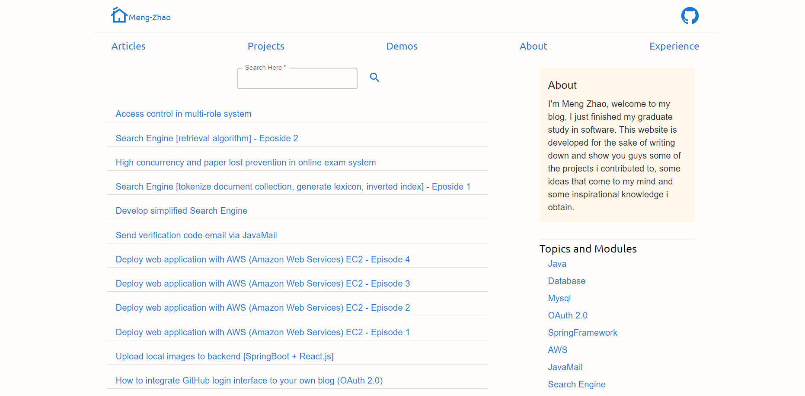

# Myblog - A personal blog
A self-developed personal blog to show my thoughts and ideas while learning and doing projects.
[OnlineURL](https://www.meng-zhao.com)

## Table of Contents
* [Technologies](#technologies)
* [Launch](#launch)
* [Examples](#examples)
* [Stage](#stage)

## Technologies
* For the front-end, I use React.js framework and Material-UI to provide outlooks.

* For back-end, I choose SpringBoot as fundemental framework.

* As for database, ORM framework: hibernate; Database: Mysql.

## Launch
### 1. Prepare Database, you need to run the db.sql in the repository to generate the database table structures. Administrator has a userid of value 1. Change the database username and password to your owns in src/main/resources/jdbc.properties

### 2. Import the project as Maven project, run maven install to install necessary dependencies.

### 3.Run BlogApplication.java in folder springbootbackend to start backend application. 

### 4. Run the following command under folder frontend to install necessary dependencies of frontend project, and start the frontend project.
```
npm install

npm start
```

### 5. The whole application will be running on localhost:3000 by default

## Examples

### 1. This is the homepage


### 2. This is the article list


### 3. This is one of the project page


### More pages will be found when you run this application

## Stage
* This blog is still under development, most of the basic functions have been implemented.

* Some features is being developed now, like commenting, sending email, and direct messages within the blog.